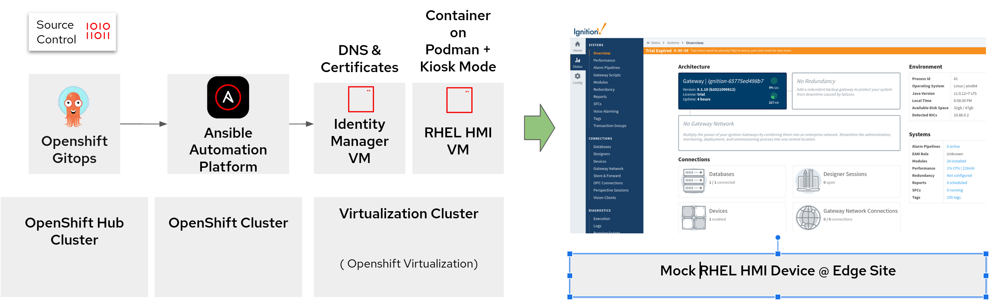

  

# Ansible Edge GitOps

{: .no_toc }

[Install](getting-started){: .btn .btn-green .fs-5 .mb-4 .mb-md-0 .mr-2 }
[Help & Feedback](https://groups.google.com/g/hybrid-cloud-patterns){: .btn .fs-5 .mb-4 .mb-md-0 .mr-2 }
[Report Bugs](https://github.com/hybrid-cloud-patterns/ansible-edge-gitops/issues){: .btn .btn-red .fs-5 .mb-4 .mb-md-0 .mr-2 }

## Table of contents

{: .no_toc .text-delta }

1. TOC
{:toc}

## Background

Organizations are interested in accelerating their deployment speeds and improving delivery quality in their Edge environments, where many devices may not fully or even partially embrace the GitOps philosophy. Further, there are VMs and other devices that can and should be managed with Ansible. This pattern explores some of the possibilities of using an OpenShift-based Ansible Automated Platform deployment and managing Edge devices, based on work done with a partner in the Chemical space.

This pattern uses OpenShift Virtualization (the productization of Kubevirt) to simulate the Edge environment for VMs.

### Solution elements

- How to use a GitOps approach to manage virtual machines, either in public clouds (limited to AWS for technical reasons) or on-prem OpenShift installations
- How to integrate AAP into OpenShift
- How to manage Edge devices using AAP hosted in OpenShift

### Red Hat Technologies

- Red Hat OpenShift Container Platform (Kubernetes)
- Red Hat Ansible Automation Platform (formerly known as "Ansible Tower")
- Red Hat OpenShift GitOps (ArgoCD)
- OpenShift Virtualization (Kubevirt)
- Red Hat Enterprise Linux 8

### Other Technologies this Pattern Uses

- Hashicorp Vault
- External Secrets Operator
- Ignition

## Architecture

Similar to other patterns, this pattern starts with a central management hub, which hosts the AAP and Vault components.

### Logical architecture

### Physical Architecture

TBD

## Recorded Demo

TBD

## Other Presentations Featuring this Pattern

### Registration Required

## What Next

- [Getting Started: Deploying and Validating the Pattern](getting-started)
