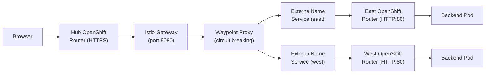
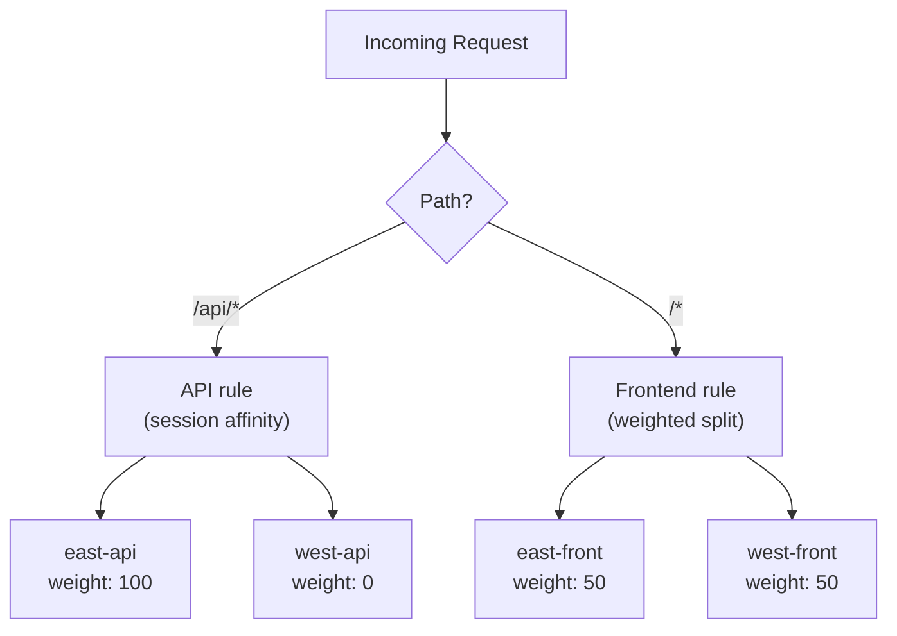

# Hub Gateway

The **hub gateway** pattern provides centralized HTTP ingress on the hub cluster with behaviors similar to an **F5 BIG-IP ADC**: VIP-style routing, TLS termination at the edge, and **weighted traffic splits** across backend services or spoke-derived routes.

## Gateway API theory

Kubernetes **Gateway API** separates concerns:

- **`Gateway`** — listens on addresses and ports; attaches TLS and listener policies.
- **`HTTPRoute`** — attaches to a `Gateway` and selects backend `Service` resources with matches, filters, and weighted backends.

Weighted rules enable **canary** or **active-active** distributions between service versions or regions when paired with mesh or multi-cluster DNS strategies.

## Cross-cluster routing architecture

[](/images/hybrid-mesh-platform/connectivity-link-hub.png)

_OpenShift Console — Gateway API resources on the hub: Gateway, HTTPRoute rules, and backend service references._

[](/images/hybrid-mesh-platform/connectivity-link-hub-gateway.png)

_Hub Gateway — HTTPRoute with weighted backends to east and west spoke ExternalName services._

[](/images/hybrid-mesh-platform/connectivity-link-spoke.png)

_Spoke cluster — Gateway API and backend services registered in the mesh._

[](/images/hybrid-mesh-platform/connectivity-link-spoke-gateway.png)

_Spoke-gateway HTTPRoute: routes `/api`, `/dashboard`, and catch-all paths to AI Computer Vision (NeuroFace) services._

The hub gateway routes traffic to spoke cluster OpenShift Routes via `ExternalName` services:



### Front / API split

Traffic is split into separate `Service` objects per cluster and traffic type to give Kiali and Grafana finer-grained visibility:

| Service | Purpose |
| ------- | ------- |
| `neuroface-east-front` | Static frontend assets for east spoke |
| `neuroface-east-api` | Socket.IO / API backend for east spoke |
| `neuroface-west-front` | Static frontend assets for west spoke |
| `neuroface-west-api` | Socket.IO / API backend for west spoke |

All four services use `ExternalName` pointing to the same spoke Route hostname, but Istio tracks them as distinct destinations. In Kiali's traffic graph, each appears as a separate node.

The `HTTPRoute` uses two rules:



1. **`/api` prefix** → routed to `*-api` services (defaults to east 100%, west 0% for Socket.IO session affinity).
2. **Catch-all** → routed to `*-front` services (split by `gateway.weights.east` / `west`).

Override API weights with `gateway.apiWeights` in values when your application supports cross-cluster API load balancing.

### Key requirements

1. **HTTP port 80, not HTTPS** — Istio ambient mode gateways do not apply `DestinationRule` TLS settings. Using HTTPS causes `CERTIFICATE_VERIFY_FAILED` errors. Spoke Routes must set `insecureEdgeTerminationPolicy: Allow`.

2. **ServiceEntry for each external host** — without a `ServiceEntry`, Envoy has no cluster definition for the external hostname and returns HTTP 500.

3. **Per-backend Host header rewrite** — the spoke OpenShift router routes by `Host` header. Use `RequestHeaderModifier` filters on each `backendRef` in the HTTPRoute.

4. **Session affinity for Socket.IO** — when load-balancing across multiple backends, Socket.IO polling and WebSocket upgrade must reach the same backend. The `/api` rule pins to a single spoke by default.

## Circuit breaking

Each `ExternalName` service gets a `DestinationRule` with `outlierDetection` and `connectionPool` settings, enforced by the `hub-gateway-system-waypoint` proxy (Istio ambient L7).

### Default configuration (aggressive / demo)

| Parameter | Default | Purpose |
| --------- | ------- | ------- |
| `connectionPool.tcp.maxConnections` | 100 | Max concurrent TCP connections |
| `connectionPool.http.h2UpgradePolicy` | `DO_NOT_UPGRADE` | Spokes expect HTTP/1.1 |
| `connectionPool.http.maxRequestsPerConnection` | 10 | Force connection recycling |
| `outlierDetection.consecutive5xxErrors` | 3 | Eject after 3 consecutive 5xx |
| `outlierDetection.interval` | 10s | Health check interval |
| `outlierDetection.baseEjectionTime` | 30s | Minimum ejection duration |
| `outlierDetection.maxEjectionPercent` | 100 | Allow ejecting the only endpoint |

`maxEjectionPercent: 100` is required because each ExternalName service resolves to a single endpoint; without it, Istio refuses to eject the last remaining host.

### Overriding circuit breaker values

Set `gateway.circuitBreaking.*` in the hub-gateway values:

```yaml
gateway:
  circuitBreaking:
    enabled: true
    outlierDetection:
      consecutive5xxErrors: 5
      baseEjectionTime: 60s
```

Set `enabled: false` to disable circuit breaking entirely.

## AI Gateway — MaaS + Kuadrant

[](/images/hybrid-mesh-platform/23-ai-gateway.png)

_AI Gateway: Kuadrant-managed API gateway for MaaS LLM endpoints with per-user rate limits and API key plans._

The platform exposes **two dedicated gateways** managed by Kuadrant, each with its own `APIProduct` published in Developer Hub:

| Gateway | Host | APIs protected |
| --- | --- | --- |
| **workshop-apis** | `https://workshop-apis.<hub-domain>` | `/httpbin/**`, `/countries/**`, `/mcp` |
| **ai-gateway** | `https://ai-gateway.<hub-domain>` | `/v1/chat/completions` (MaaS LLM) |

Authentication uses header `Authorization: APIKEY <key>` (not Bearer). Plan tiers: **bronze / silver / gold** on workshop-apis; **free / gold** on ai-gateway LLM routes.

### APIProduct for MaaS LLM

```yaml
apiVersion: devportal.kuadrant.io/v1alpha1
kind: APIProduct
metadata:
  name: workshop-llm-tokens
  namespace: ai-gateway-system
spec:
  displayName: AI Gateway — MaaS LLM (TokenRateLimit)
  documentation:
    openAPISpecURL: https://raw.githubusercontent.com/openai/openai-openapi/master/openapi.yaml
  targetRef:
    kind: HTTPRoute
    name: ai-maas
```

### Consuming the AI Gateway

Applications that speak the OpenAI REST API can consume the AI Gateway without code changes. NeuroFace can switch between direct MaaS and the AI Gateway:

| Path | Endpoint | When to use |
| --- | --- | --- |
| **Direct MaaS** (default) | `https://maas-rhdp.apps.maas.redhatworkshops.io/v1` | Simplicity; key from Vault/ESO |
| **AI Gateway** (Kuadrant) | `https://ai-gateway.<hub-domain>/v1` | Demo API management — rate limits, API keys via Developer Hub |

```bash
# Test AI Gateway directly
curl -sk "https://ai-gateway.<hub-domain>/v1/chat/completions" \
  -H "Authorization: APIKEY <kuadrant-api-key>" \
  -H "Content-Type: application/json" \
  -d '{"model":"granite-3-2-8b-instruct","messages":[{"role":"user","content":"hello"}]}'
```

## MCP Gateway + OpenShift Lightspeed

[](/images/hybrid-mesh-platform/24-mcp-gateway.png)

_MCP Gateway: dual-server (Quarkus 19 tools + Go SDK 21 tools) integrated with OpenShift Lightspeed for natural-language platform operations._

The MCP Gateway runs on the hub and exposes OpenShift cluster state through natural language. It integrates with `OLSConfig` so operators can query and act on platform state without raw YAML.

## Relationship to Connectivity Link

Connectivity Link (Kuadrant) layers DNS automation, TLS policies, and advanced controls atop Gateway API. Start with plain HTTPRoutes if you need incremental adoption; enable Kuadrant policies when teams are ready.

## Operational notes

- Keep **hostnames aligned** with `deployer.domain` and corporate DNS wildcard records.
- Combine with **Service Mesh ambient** when east-west encryption between gateway hops and workloads matters.
- Monitor the gateway Envoy proxy metrics at port 15020 `/stats/prometheus`.

---

**Next:** See the [pattern documentation](https://maximilianopizarro.github.io/hybrid-mesh-platform/validatedpatterns-docs/hub-gateway.html) for extended RHCL and Kuadrant detail.

## References

- [Kubernetes Gateway API](https://gateway-api.sigs.k8s.io/)
- [Connectivity Link documentation](https://docs.redhat.com/en/documentation/red_hat_connectivity_link/)
- [Istio DestinationRule](https://istio.io/latest/docs/reference/config/networking/destination-rule/)

Implementation chart: `charts/all/hub-gateway`.

---

**Next →** [Observability](observability) for Grafana dashboards, Kiali traffic graphs, and Kafka Console across clusters.
