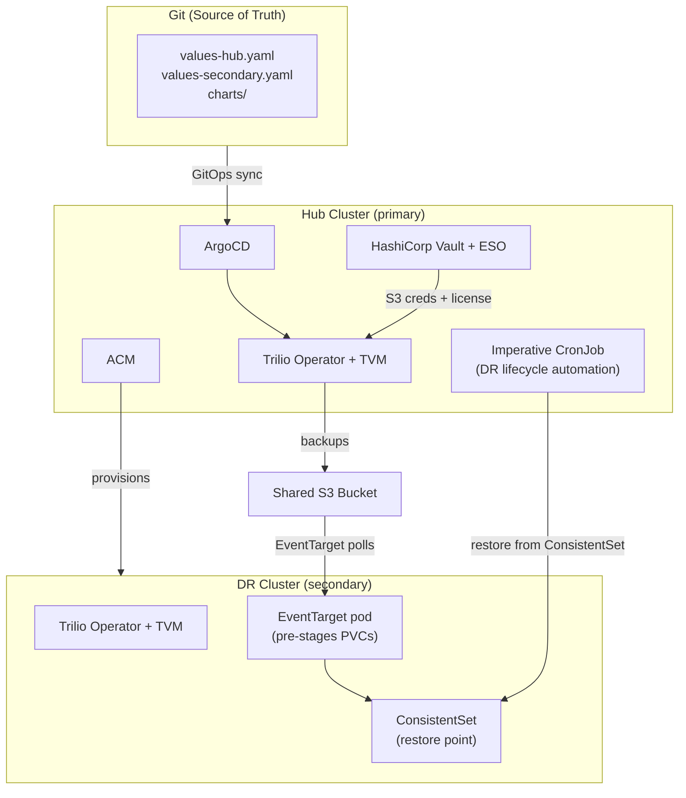

# Trilio Continuous Restore — Red&nbsp;Hat Validated Pattern

## Overview

This Validated Pattern delivers an automated, GitOps-driven Disaster Recovery (DR) solution for stateful applications running on Red&nbsp;Hat OpenShift. By integrating [Trilio for Kubernetes](https://trilio.io) with the [Red&nbsp;Hat Validated Patterns framework](https://validatedpatterns.io), the pattern delivers:

- **Automated backup** of stateful workloads on the primary (hub) cluster
- **Continuous Restore** — Trilio's accelerated Recovery Time Objective (RTO) DR path that continuously pre-stages backup data on the DR cluster so that recovery requires only metadata retrieval, not a full data transfer
- **Automated DR testing** — the full backup-to-restore lifecycle runs as a scheduled, self-healing GitOps workflow with no human intervention after initial setup
- **Multi-cluster lifecycle management** through Red&nbsp;Hat Advanced Cluster Management (ACM)

### Use case

The pattern targets organizations that need a documented, repeatable DR posture for Kubernetes-native workloads — particularly those that must demonstrate RTO/Recovery Point Objective (RPO) targets through regular, automated DR tests rather than annual manual exercises.

A WordPress + MySQL deployment is included as a representative stateful application. It serves as the reference workload for the full backup, restore, and URL-rewrite lifecycle.

---

## Architecture

### Component roles

| Component | Where | Role |
|-----------|-------|------|
| Trilio Operator | Hub + Spoke | Installed through Operator Lifecycle Manager (OLM) from the `certified-operators` catalog, channel `5.3.x` |
| TrilioVaultManager | Hub + Spoke | Trilio operand Custom Resource (CR); manages the Trilio data plane |
| Red&nbsp;Hat OpenShift | Hub + Spoke | Container orchestration platform; provides OLM, storage, networking, and the GitOps operator substrate |
| Red&nbsp;Hat OpenShift GitOps (ArgoCD) | Hub + Spoke | GitOps sync engine; all configuration is driven from Git |
| Red&nbsp;Hat Advanced Cluster Management (ACM) | Hub | Cluster lifecycle, policy enforcement, and spoke provisioning |
| Validated Patterns Imperative CronJob | Hub + Spoke | Runs the automated DR lifecycle on a 10-minute schedule |
| BackupTarget | Hub + Spoke | Points to the shared S3 bucket; the spoke BackupTarget has the EventTarget flag set |
| BackupPlan | Hub | Defines backup scope (wordpress namespace), quiesce/unquiesce hooks, and retention |
| CR BackupPlan | Hub | Continuous Restore variant of BackupPlan; drives pre-staging on the spoke |
| EventTarget pod | Spoke | Watches the shared S3 bucket for new backups; pre-stages Persistent Volume Claims (PVCs) locally |
| ConsistentSet | Spoke | Cluster-scoped CR representing a fully pre-staged restore point |
| HashiCorp Vault and External Secrets Operator (ESO) | Hub | Secret management; S3 credentials and Trilio license are never stored in Git |

### How Continuous Restore works

1. The hub creates a backup using the CR BackupPlan and writes it to the shared S3 storage.
2. The EventTarget pod on the spoke detects the new backup and begins copying volume data locally — ahead of any DR event.
3. When the spoke's imperative job detects an Available ConsistentSet, it submits a Restore CR. Because the data is already local, only backup metadata is fetched — resulting in significantly lower RTO than a standard on-demand restore.
4. The post-restore Hook CR rewrites WordPress database URLs to the DR cluster's ingress domain.

## Links

- [Trilio for Kubernetes documentation](https://docs.trilio.io/kubernetes)
- [Red&nbsp;Hat Validated Patterns](https://validatedpatterns.io)
- [Validated Patterns imperative framework](https://validatedpatterns.io/learn/imperative-actions/)
- [Red&nbsp;Hat Advanced Cluster Management (ACM)](https://access.redhat.com/documentation/en-us/red_hat_advanced_cluster_management_for_kubernetes)
- [External Secrets Operator](https://external-secrets.io)

## Next steps

- [Prerequisites](prerequisites)
- [Getting started](getting-started)
- [CR operations](cr-operations)
- [Troubleshooting](troubleshooting)
