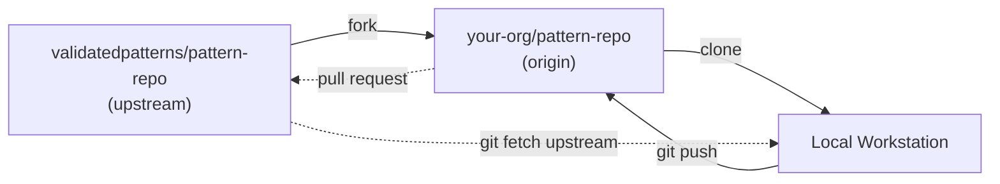

---
menu:
  workshop:
    parent: Validated Patterns
title: To Fork or Not to Fork
weight: 55
---

## Why fork?

* You need to be able to make changes for your own organization's needs
* GitOps is all about git, merging changes safely is foundational
* Some changes make sense to be merged upstream
* You can make a pull request (PR) on the upstream pattern

## Typical recommended fork structure

**Git Workflow**

* Find the pattern closest to the solution you require
  * Often this is [multicloud-gitops](https://github.com/validatedpatterns/multicloud-gitops)
* Fork the repository into your organization or personal account
* Clone your fork to your local workstation
* Deploy / Change / Test
* Create pull requests to the repo and merge
