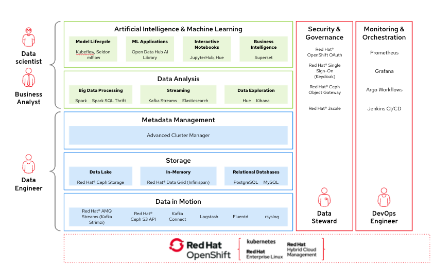

# Industrial Edge Atlas
{: .no_toc }

## Table of contents
{: .no_toc .text-delta }

1. TOC
{:toc}

## Background

With this Atlas, we demonstrate a horizontal solution for IoT Edge use cases.

The specific example is live defect detection based on sensor data in an
industrial setting, but it could easily be applicable to other verticals.

### Solution elements

- How to use a GitOps approach to keep in control of configuration and operations
- How to centrally manage multiple clusters, including workloads
- How to build and deploy workloads across clusters using modern CI/CD
- How to train AI/ML models in the public cloud with data from the private cloud, and bring the executable model back to on prem.
- IoT Edge

### Red Hat Technologies

- OpenShift
- OpenShift GitOps (ArgoCD)
- OpenShift Pipelines (Tekton)
- OpenShift Container Storage
- Advanced Cluster Management
- Open Data Hub
- AMQ (MQTT Message broker)
- AMQ Streams (Kafka Event Broker)
- Camel-K Integrations

## Architecture

## Recorded Demo

## Prerequisties

## Initial Deployment

## Validating the Environment

## What Next
